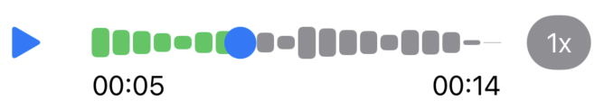

[](https://swift.org/package-manager/)

# JSWaveform

JSWaveform is a Swift Package that has native interfaces consisting of audio engine and pure animatable SwiftUI components in **iOS**, **iPadOS** and **visionOS**. 

## Requirements

Swift Package contains full source code under MIT License. The package can be deployed on iOS and iPadOS 17 and later, and visionOS 1 or later. The package supports full Swift and SwiftUI projects. This package **doesn't** contain any UIKit components.

## Installation

Please check out [Swift Package Manager documentation](https://www.swift.org/documentation/package-manager/) if you are new to Swift Package Manager.

Use URL `https://github.com/juraskrlec/JSWaveform` and use the latest version.

```
import JSWaveform
```

## Usage

`JSWaveform` provides native Swift and SwiftUI components. For now, it has 2 major SwiftUI views:

* `AudioPlayerView`
* `AudioVisualizerView`

### AudioPlayerView

`AudioPlayerView` renders audio player which consits of play/pause button, downsampled waveform and time pitch effect button. 



### Usage

```swift
    let url = Bundle.main.url(forResource: "Example", withExtension: "aif")
    AudioPlayerView(audioURL: url!)
```

### Configuration

If you want to configure it, you can, by setting [AudioPlayer.Configuration](https://github.com/juraskrlec/JSWaveform/blob/main/Sources/JSWaveform/Views/AudioPlayer/Configurations/AudioPlayerConfiguration.swift) in it's init. 

### AudioVisualizerView

`AudioVisualizerView` renders audio visualizer which animates [AudioVisualizerShape](https://github.com/juraskrlec/JSWaveform/blob/main/Sources/JSWaveform/Views/AudioVisualizer/AudioVisualizerShape.swift) based on audio amplitudes. This image shows default animation called `symetricMiddleHigh` where peak amplitudes are in the middle and average on the sides. You can see more available animations and set them using [AudioVisualizer.Configuration](https://github.com/juraskrlec/JSWaveform/blob/main/Sources/JSWaveform/Views/AudioVisualizer/Configurations/AudioVisualizerConfiguration.swift).


### Usage

```swift
    let url = Bundle.main.url(forResource: "Example", withExtension: "aif")
    AudioVisualizerView(audioURL: url!)
```

You can also play/stop audio. Example:

```swift
    Toggle("Play audio", isOn: $playAudio)
        .tint(.blue)
        .onChange(of: playAudio) { _, _ in
            if playAudio {
                audioVisualizerView.playAudio()
            }
            else {
                audioVisualizerView.stopAudio()
            }
        }
```

### Configuration

If you want to configure it, you can, by setting [AudioVisualizer.Configuration](https://github.com/juraskrlec/JSWaveform/blob/main/Sources/JSWaveform/Views/AudioVisualizer/Configurations/AudioVisualizerConfiguration.swift) in its init. 

## Read more about it

You can read more about this at my site [juraskrlec.com](https://juraskrlec.com).

## Connect

[Linkedin](https://www.linkedin.com/in/juraskrlec/)
[Twitter/X](https://www.x.com/SkrlecJura)

